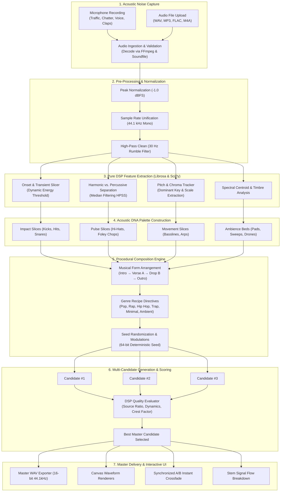
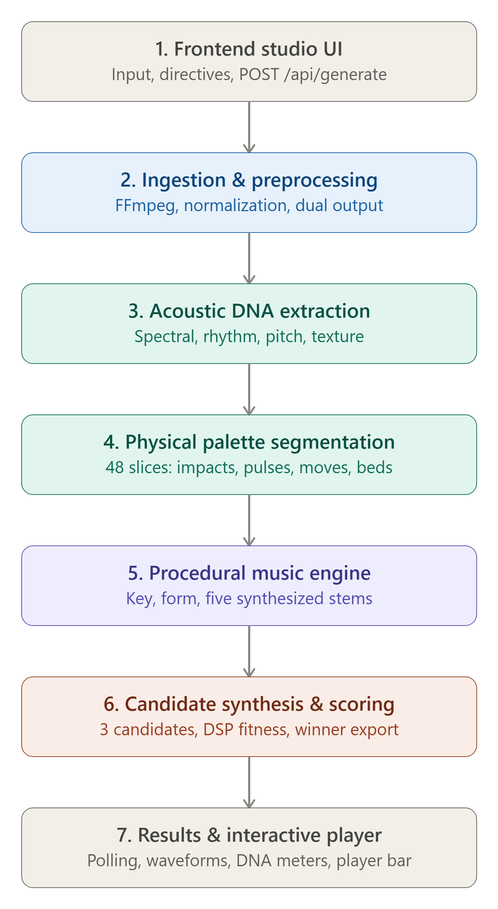

# THE UNNECESSARY FM 📻✨

> **Turns random, everyday noise into full produced songs using 100% procedural Digital Signal Processing (DSP).**  
> Record street traffic, loud room chatter, speaking words aloud, or clapping and ta daa... your song is ready!

---

## Basic Details

### Team Name: MiNa
### Team Members
- **Team Lead:** MIDHUN K M — *NSS College of Engineering, Palakkad*
- **Member 2:** NAYANA P — *NSS College of Engineering, Palakkad*

### Hosted Project Link
- 🌐 **Live Web App:** [useless-project-mina.onrender.com](https://useless-project-mina.onrender.com/)
- 🎥 **Video Walkthrough:** [YouTube Demo](https://youtu.be/6UWJPu9qXvg?si=80bX1X65h8RAKWNL)

---

## Project Description

**THE UNNECESSARY FM** turns random noise into music.. you record or upload, ta daa... your music is ready using **pure algorithmic DSP!**

---

## The Problem (that doesn't exist)

The world is full of perfectly ordinary noises like loud honking auto-rickshaws, loud cafeteria chatter, squeaky swivel chairs, kitchen utensils clattering, and people muttering, but for some reason, they aren't songs. We decided this was unacceptable.

---

## The Solution (that nobody asked for)

We built an algorithmic DSP production studio that turns ordinary noises into songs. Because apparently, just being a noise wasn't enough.

Feed it any audible sound, pick your style, hit **CREATE MUSIC**, and listen to your noise transformed into a produced composition with dual scrubbable waveforms, real-time A/B source comparison, and multi-stem architectural breakdowns.

---

## 🔊 Sound Input Guide: What Sounds Make the Best Music?

> [!IMPORTANT]
> **The Golden Rule: Give it audible volume and dynamic texture!**  
> The procedural DSP engine relies on clear acoustic energy, pitch variations, and rhythmic transients to extract notes and slices. If the input sound is silent or too faint, the music engine has nothing to work with.

| Sound Type | Result | Why It Works / What to Expect |
|---|---|---|
| **Street & City Traffic** 🚗 | 🌟🌟🌟🌟🌟 Exceptional | Rich frequency spectrum, engine rumbles translate to punchy sub-bass, tire whooshes become lush sweeping risers. |
| **Room / Cafe Chatter** 🗣️ | 🌟🌟🌟🌟🌟 Exceptional | Formant peaks and vocal cadence slice into rhythmic chops, vocoder-style hooks, and vocal percussion. |
| **Speaking Random Words Aloud** 🎙️ | 🌟🌟🌟🌟🌟 Exceptional | Clear consonants and vowels yield sharp transient attacks for snares, hi-hats, and melodic lead instruments. |
| **Singing or Humming** 🎵 | 🌟🌟🌟🌟🌟 Exceptional | Pitch tracker locks onto your fundamental notes and re-synthesizes full modal chord progressions around your voice. |
| **Keys Jangling & Clapping** 🔑 | 🌟🌟🌟🌟 Amazing | High-frequency transient bursts transform into crisp hi-hat rolls, shakers, and syncopated percussion. |
| **Banging Pots & Kitchen Percussion** 🍳 | 🌟🌟🌟🌟 Amazing | Resonant metallic tones slice into kicks, 808 subs, and melodic mallets. |
| *Faint Fan Noise or Hum* 💨 | ⚠️ Poor / Too Faint | Low constant hums lack dynamic transients and pitch contours, leading to faint or static-like output. |
| *Tiny Mouse Click or Soft Tap* 🖱️ | ⚠️ Poor / Insufficient | A single quiet click lacks sustained energy. Boost mic gain or make repetitive, energetic sounds! |

---

## Technical Details

### Technologies Used

- **Languages:** Python 3.10+, JavaScript (ES6+), HTML5, Vanilla CSS3
- **Backend Framework:** [FastAPI](https://fastapi.tiangolo.com/), [Uvicorn](https://www.uvicorn.org/) (Asynchronous REST API)
- **Audio DSP Pipeline:**
  - `numpy` & `scipy`: Fast Fourier Transforms (FFT), convolution, biquad IIR/FIR filter design, envelope followers
  - `librosa`: Spectral centroid, zero-crossing rates, chromagram pitch tracking, onset envelope detection
  - `soundfile`: High-fidelity uncompressed 16-bit 44.1kHz master WAV reading/writing
  - `ffmpeg`: Universal audio decoding (MP3, WAV, AAC, M4A, FLAC, OGG, WEBM)
- **Frontend Architecture:**
  - Spotify-grade dark UI design system (zero third-party UI framework bloat)
  - HTML5 Canvas dual interactive scrubbable waveform visualizers
  - Real-time A/B synchronized audio comparison engine with continuous crossfade
  - Seed-deterministic reproducible procedural compositions

---

## System Architecture & Signal Flow



---

## Musical Genre Presets

The engine procedurally arranges tracks using authentic producer recipes:

1. **Pop (122 BPM):** 4-on-the-floor driving kick, rolling 16th electro bass, syncopated pop claps, and bright transient foley chops.
2. **Rap / Electro (104 BPM):** French-touch resonant low-pass filter sweeps, funky disco basslines, and soulful vocal/noise chops.
3. **Hip Hop (92 BPM):** Swung MPC boom-bap beat, warm vinyl saturation, and relaxed lo-fi chord progressions.
4. **Trap (138 BPM):** Heavy pitch-bending gliding 808 sub-bass, rapid triplet hi-hat rolls, and dark cinematic pads.
5. **Minimal (126 BPM):** Progressive house and UK garage pulse with hypnotic syncopated grooves.
6. **Ambient Drone:** Ethereal evolving textures, harmonic drone beds, and zero drums for relaxing meditation.

---

## Installation & Local Setup

### Prerequisites
- **Python 3.10+**
- **FFmpeg** installed and added to system PATH

### 1. Clone the Repository
```bash
git clone https://github.com/nayanapottekkad/useless_project_MiNa.git
cd useless_project_MiNa
```

### 2. Create and Activate a Virtual Environment
```bash
# Windows
python -m venv venv
.\venv\Scripts\activate

# macOS / Linux
python3 -m venv venv
source venv/bin/activate
```

### 3. Install Dependencies
```bash
pip install -r requirements.txt
```

### 4. Run the Application
```bash
py -m uvicorn app.main:app --port 8080 --reload
```

### 5. Open in Browser
Open your browser and navigate to:
```
http://localhost:8080/
```

---

## API Documentation

FastAPI provides an automatic Swagger UI at `http://localhost:8080/docs`.

- **`POST /api/generate`**: Upload audio (multipart form) along with genre, energy (`balanced`, `low`, `high`), output duration (`30` or `60`s), and optional seed.
- **`GET /api/jobs/{job_id}`**: Poll job progress, logs, status, and generated composition metadata.
- **`GET /api/audio/{filename}`**: Stream uncompressed generated audio.
- **`GET /api/health`**: Health check and system verification.

---

## Project Screenshots

### 1. Studio Dashboard & Hero

*Modern Spotify-inspired studio interface with direct audio upload and microphone recording.*

### 2. Composition Directives & Sound Styles

*Interactive genre shelf selecting Pop, Rap/Electro, Hip Hop, Trap, Minimal, or Ambient.*

### 3. Procedural DSP Signal Processing

*Algorithmic transient extraction, HPSS harmonic separation, and multi-candidate scoring in progress.*

### 4. Dual Waveform Player & A/B Instant Comparison

*Interactive audio workspace with scrubbable waveforms, A/B instant compare, master WAV download, and stem architecture breakdown.*

### 5. Architecture & DSP Signal Flow


---

## Project Demo

- 📺 **Watch Demo on YouTube:** [https://youtu.be/6UWJPu9qXvg?si=80bX1X65h8RAKWNL](https://youtu.be/6UWJPu9qXvg?si=80bX1X65h8RAKWNL)
- 🚀 **Try Live on Render:** [https://useless-project-mina.onrender.com/](https://useless-project-mina.onrender.com/)

---

Made with ❤️ at **TinkerHub Useless Projects 3.0**

[](https://www.tinkerhub.org/)
[](https://tinkerhub.org/events/1M8ORET9A1/useless-projects-3.0)
