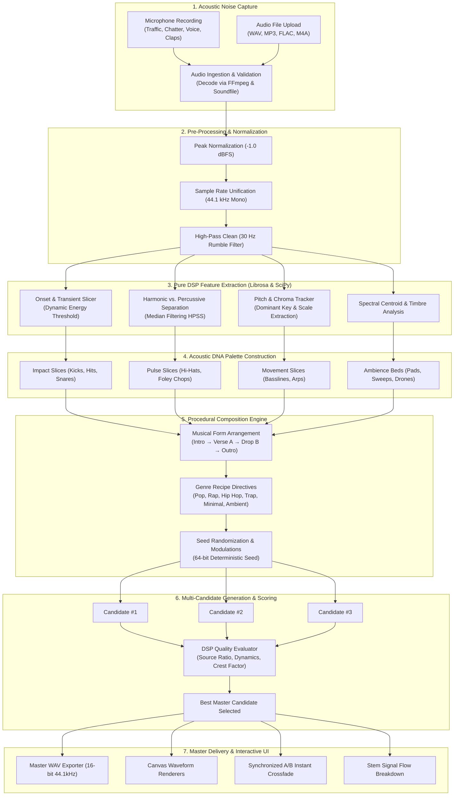
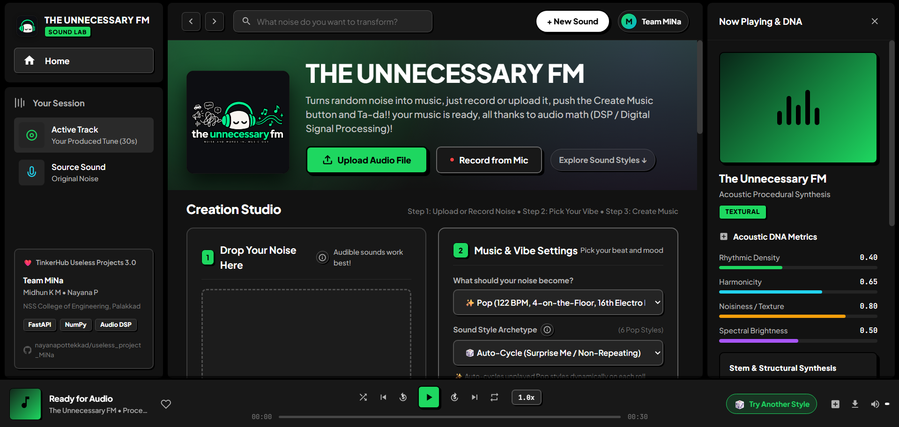
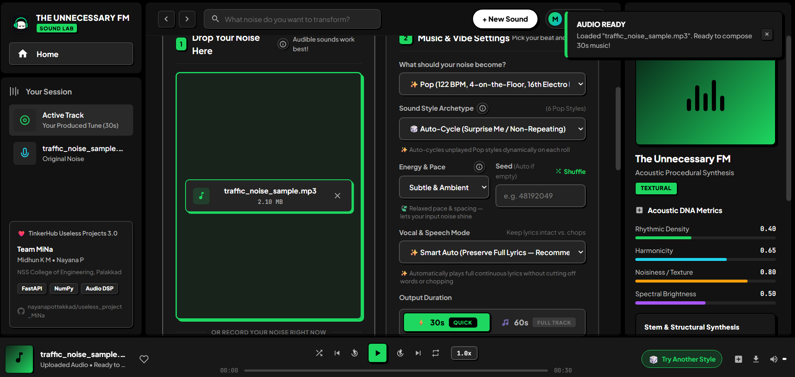
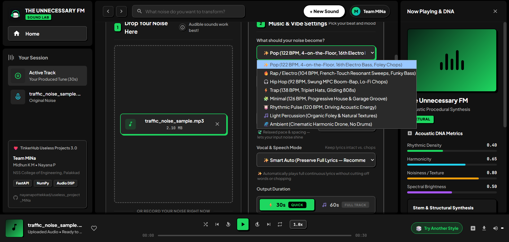
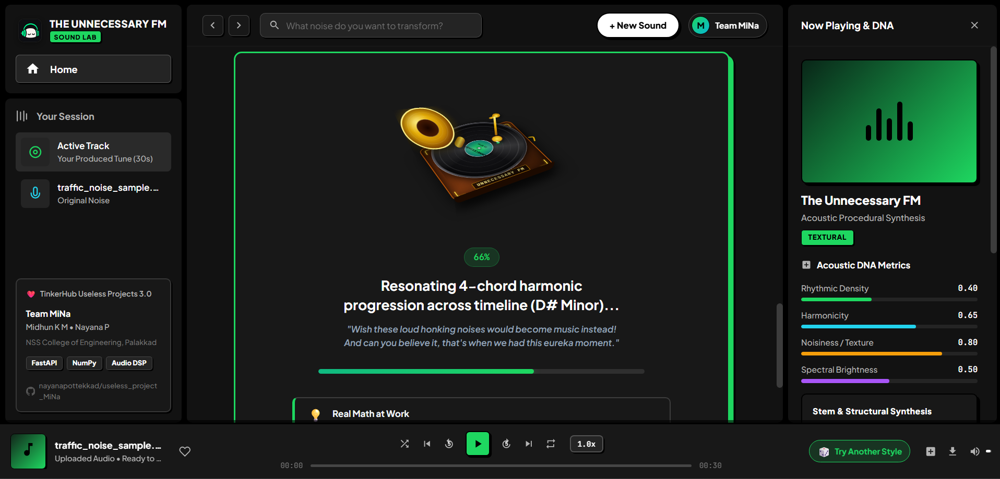
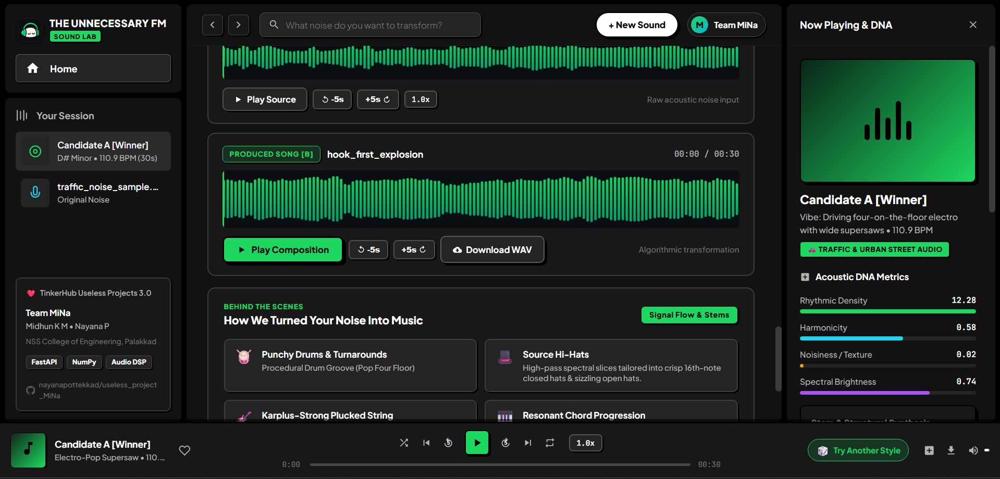

# THE UNNECESSARY FM 📻✨

> **Turns random, everyday noise into full produced songs using math & audio processing (DSP / Digital Signal Processing).**  
> Record street traffic, loud room chatter, speaking words aloud, or clapping, click Create Music and ta daa... your song is ready!

---

## Basic Details

### Team Name: MiNa
### Team Members
- **Team Lead:** MIDHUN K M (*NSS College of Engineering, Palakkad*)
- **Member 2:** NAYANA P (*NSS College of Engineering, Palakkad*)

### Hosted Project Link
- 🌐 **Live Web App:** [useless-project-mina.onrender.com](https://useless-project-mina.onrender.com/)
- 🎥 **Video Walkthrough:** [YouTube Demo](https://youtu.be/6UWJPu9qXvg?si=80bX1X65h8RAKWNL)

---

## Project Description

**THE UNNECESSARY FM** turns random noise into music, just record or upload it, push the Create Music button and there you have it... your music is ready, all thanks to audio math (DSP / Digital Signal Processing)!

> 💡 **Wait a minute, what on Earth is DSP? Just how does mathematics actually create music?**  
> DSP stands for **Digital Signal Processing**, which is merely a fancy engineering way of putting it when one means **'carrying out magic math on sound waves'**! Here is the way that math actually constructs a song from your noise:
> 
> - 🔍 **Frequency X-Ray (Fourier Math):** The equations examine your noisy waveform to reveal the hidden pitches and frequencies that are secretly contained within it.
> - ✂️ **The Geometric Scalpel (Transient Slicing):** Sudden acoustic spikes (for example, a clap, a cough, or a clatter of utensils) are cut into sharp drums such as kicks, snares, and hi-hats.
> - 🎤 **Universal Scale Auto-Tuner & Vocal Lead:** Tracks speech vowels, hums, and singing takes, quantizing them frame-by-frame to the song's musical key without cutting off lyrics or words, plus stacking lush 3rd/5th choir harmonies!
> - 🎹 **Harmonic Sifting & Resonant Modeling:** Mathematics is used to distinguish the drums from the continuous hums, identifies the nearest musical scale (for example, C minor), and converts the noise into melodic bass lines and synth sounds.
> - 🎛️ **The Algorithmic Producer:** Takes all the chopped noise samples and places them on a rhythmic tempo grid (BPM), then organises the entire song in the following order: Intro → Verse → Drop → Outro!

---

## The Problem (that doesn't exist)
We were walking in the evening thinking what to build for this hackathon, and while passing by that heavy traffic, he (yeah my team mate) told me something stupid, "wish these loud honking noises would become music instead!". And can you believe it? that's when we had this eureka moment!

We realised the world is full of perfectly ordinary noises like loud honking auto-rickshaws, loud cafeteria chatter, squeaky swivel chairs, kitchen utensils clattering, and people muttering, but for some reason, they aren't songs. We decided this was unacceptable... (or maybe it's just us?)

---

## The Solution (that nobody asked for)

We had absolute fun developing and testing this thing!

We wanted to see what we could do with math and signal processing. We've been shouting hello, hi, bye, counting numbers into laptop mics, capturing clapping noises and laughing at the way this dissected the noise and turned it into nice tunes.

Just give it any audible sound, choose your style and press **CREATE MUSIC** button. TA-DA!!! Your music is ready!

---

## 🔊 Sound Input Guide: What Sounds Make the Best Music?

> [!IMPORTANT]
> **The Golden Rule: Give it audible volume and dynamic texture!**  
> The music engine relies on clear acoustic energy, pitch variations, and rhythm spikes to extract notes and slices. If the input sound is completely silent or too faint, there is nothing for the algorithms to work with.

| Sound Type | Result | Why It Works / What to Expect |
|---|---|---|
| **Street & City Traffic** 🚗 | 🌟🌟🌟🌟🌟 Exceptional | Rich frequency spectrum, engine rumbles translate to punchy sub-bass, tire whooshes become lush sweeping risers. |
| **Room / Cafe Chatter** 🗣️ | 🌟🌟🌟🌟🌟 Exceptional | Formant peaks and vocal cadence slice into rhythmic chops, vocoder-style hooks, and vocal percussion. |
| **Speaking Random Words Aloud** 🎙️ | 🌟🌟🌟🌟🌟 Exceptional | Clear consonants and vowels yield sharp transient attacks for snares, hi-hats, and melodic lead instruments. |
| **Singing or Humming** 🎵 | 🌟🌟🌟🌟🌟 Exceptional | Pitch tracker locks onto your fundamental notes and re-synthesizes full modal chord progressions around your voice, with multi-part choir harmonization. |
| **Beatboxing & Mouth Drums** 🥁 | 🌟🌟🌟🌟🌟 Exceptional | Specialized transient extraction splits lip bass kicks, mouth snares, and hi-hats into a punchy authentic acoustic drum kit. |
| **Keys Jangling & Clapping** 🔑 | 🌟🌟🌟🌟 Amazing | High-frequency transient bursts transform into crisp hi-hat rolls, shakers, and syncopated percussion. |
| **Banging Pots & Kitchen Percussion** 🍳 | 🌟🌟🌟🌟 Amazing | Resonant metallic tones slice into kicks, 808 subs, and melodic mallets. |
| *Faint Fan Noise or Hum* 💨 | ⚠️ Poor / Too Faint | Low constant hums lack dynamic transients and pitch contours, leading to faint or static-like output. |
| *Tiny Mouse Click or Soft Tap* 🖱️ | ⚠️ Poor / Insufficient | A single quiet click lacks sustained energy. Boost mic gain or make repetitive, energetic sounds! |

---

## Technical Details

### Technologies Used

- **Languages:** Python 3.10+, JavaScript (ES6+), HTML5, Vanilla CSS3
- **Backend Framework:** [FastAPI](https://fastapi.tiangolo.com/), [Uvicorn](https://www.uvicorn.org/) (Asynchronous REST API)
- **Audio & Math Engine (Who ever thought math + noise = music?!):**
  - Whoever thought you could use math + noise to get actual music??
  - Honestly, I never thought I'd use trigonometry in real life, but wow... sine waves, frequencies, and math formulas actually make fire songs!
  - `numpy` & `scipy`: Fast Fourier Transforms (FFT), convolution, biquad IIR/FIR filter design, envelope followers, autocorrelation pitch estimation
  - `librosa`: Spectral centroid, zero-crossing rates, chromagram pitch tracking, onset envelope detection
  - `Custom Studio Auto-Tuner`: Sliding frame-by-frame pitch quantization to scale notes, granular WSOLA length preservation, formant tilt correction, and multi-voice choir harmonization (`[0, 3/4, 7]` semitones)
  - `soundfile`: High-fidelity uncompressed 16-bit 44.1kHz master WAV reading/writing
  - `ffmpeg`: Universal audio decoding (MP3, WAV, AAC, M4A, FLAC, OGG, WEBM)
- **Frontend Architecture:**
  - Sleek Spotify-inspired dark UI built with vanilla CSS, no heavy UI framework bloat
  - Interactive scrubbable waveform players drawn directly on HTML5 Canvas
  - Real-time synchronized A/B audio comparison with smooth crossfading
  - Fully reproducible songs generated with customizable random seeds

---

## System Architecture & Signal Flow



---

## Musical Genre Presets

The engine procedurally arranges tracks using authentic producer recipes:

1. **Pop (122 BPM):** 4-on-the-floor driving kick, rolling 16th electro bass, syncopated pop claps, and bright transient foley chops.
2. **Rap / Electro (104 BPM):** French-touch resonant low-pass filter sweeps, funky disco basslines, and soulful vocal/noise chops.
3. **Hip Hop (92 BPM):** Swung MPC boom-bap beat, warm vinyl saturation, and relaxed lo-fi chord progressions.
4. **Trap (138 BPM):** Heavy pitch-bending gliding 808 sub-bass, rapid triplet hi-hat rolls, and dark cinematic pads.
5. **Minimal (126 BPM):** Progressive house and UK garage pulse with hypnotic syncopated grooves.
6. **Ambient Drone:** Ethereal evolving textures, harmonic drone beds, and zero drums for relaxing meditation.

---

## Installation & Local Setup

### Prerequisites
- **Python 3.10+**
- **FFmpeg** installed and added to system PATH

### 1. Clone the Repository
```bash
git clone https://github.com/nayanapottekkad/useless_project_MiNa.git
cd useless_project_MiNa
```

### 2. Create and Activate a Virtual Environment
```bash
# Windows
python -m venv venv
.\venv\Scripts\activate

# macOS / Linux
python3 -m venv venv
source venv/bin/activate
```

### 3. Install Dependencies
```bash
pip install -r requirements.txt
```

### 4. Run the Application
```bash
py -m uvicorn app.main:app --port 8080 --reload
```

### 5. Open in Browser
Open your browser and navigate to:
```
http://localhost:8080/
```

---

## API Documentation

FastAPI provides an automatic Swagger UI at `http://localhost:8080/docs`.

- **`POST /api/generate`**: Upload audio along with genre preference, energy level, output duration, and optional random seed.
- **`GET /api/progress/{job_id}`**: Server-Sent Events (SSE) stream for real-time generation progress and stage updates.
- **`GET /api/status/{job_id}`**: Check job status, current stage, and progress percentage.
- **`GET /api/result/{job_id}`**: Retrieve full composition metadata, audio analysis DNA, and candidate links.
- **`GET /api/audio/{job_id}/{candidate_id}`**: Stream generated master WAV audio file.
- **`GET /api/health`**: Fast health check and uptime verification.

---

## Project Screenshots

### 1. Studio Dashboard & Hero

*The initial interface where you can drop your recorded traffic noise (why would you have that?) or record you 
beatboxing, clapping, counting or just saying your own name (say my name!!)!!*

### 2. Composition Directives & Sound Styles

*Select what would you like your noise to become. A rap song? A pop song? A hip-hop song? Wait, Wait an rap song from recording of you saying your crush's name??*

### 3. Sound Styles & Presets Dropdown

*All the flavors you can turn your noise into! From pop, rap, boom-bap hip-hop, heavy 808 trap, all the way to chill ambient drone (when you just need peace and quiet).*

### 4. Procedural DSP Signal Processing

*You wait for a few minute, thinking what magic is happening in the background? Don't worry we are just extracting the soul of that noise, and turning it into something, uhh, pleasing?*

### 5. Dual Waveform Player & A/B Instant Comparison

*Now listen to your noise, uhh I mean, your song! You can compare it with the original noise too, isn't it just fun?*

---

## Project Demo

- 📺 **Watch Demo on YouTube:** [https://youtu.be/6UWJPu9qXvg?si=80bX1X65h8RAKWNL](https://youtu.be/6UWJPu9qXvg?si=80bX1X65h8RAKWNL)
- 🚀 **Try Live on Render:** [https://useless-project-mina.onrender.com/](https://useless-project-mina.onrender.com/)

---

Made with ❤️ at **TinkerHub Useless Projects 3.0**

[](https://www.tinkerhub.org/)
[](https://tinkerhub.org/events/1M8ORET9A1/useless-projects-3.0)
